# ViDiExPo: Video-Supervised Disentanglement with Interaction-Aware Fusion for Controllable Expression and Pose in Diffusion Models

**Paper:** ViDiExPo (Expert Systems with Applications, submitted June 2026)  
---

## Overview

ViDiExPo is a two-stage framework for controllable facial image synthesis:

```
I_id (identity) + I_ref (reference) + T (text)
           ↓
[Stage 1: DSID]  →  (E_id, E_sem)   factorized embeddings
           ↓
[Stage 2: MRF]   →  (Ẽ_id, Ẽ_sem)  interaction-aware embeddings
           ↓
[Diffusion SDXL] →  Î              output image
```

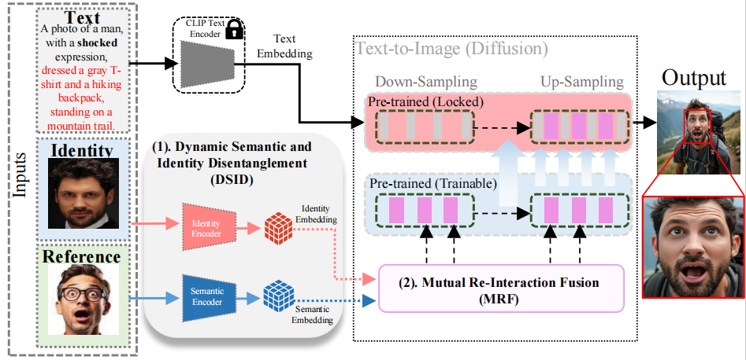  
**Description:** ViDiExPo generates identity-consistent facial images with controllable expressions and head poses using three inputs: a text prompt for context, an identity image, and a reference image for semantic cues. Identity and semantic features are disentangled via DSID and fused via the MRF module into a pre-trained Stable Diffusion XL backbone.

**Key components:**
- **DSID** (Dynamic Semantic and Identity Disentanglement): learns factorized identity and semantic embeddings using identity-consistent paired frames with semantic variation, with explicit MI minimization via CLUB
- **MRF** (Mutual Re-Interaction Fusion): bidirectional cross-attention that reconstructs identity–semantic dependencies before diffusion conditioning

**Key results:** IDsim=0.52, Semdist=0.29, EXPAcc=82%, Poseerr=2.50, FID=19.21

---

## Repository Structure

```
ViDiExPo/
├── DSID/                          # Dynamic Semantic and Identity Disentanglement
│   ├── modules/
│   │   ├── dsid.py                # Core DSID architecture
│   │   │   ├── IdentityEncoder    # f_id: ResNet-50, metric learning optimized
│   │   │   ├── SemanticEncoder    # f_sem: ResNet-50 + HAL aggregation
│   │   │   ├── HAL                # Hierarchical Aggregation Layer 
│   │   │   ├── CLUBEstimator      # MI upper bound for MID loss 
│   │   │   ├── AAMSoftmax         # Additive angular margin 
│   │   │   └── DSIDModule         # Full module (train + inference modes)
│   │   └── losses.py              # DSID training losses 
│   │       ├── DSIDLoss           # L = λ1*Lrecon + λ2*Lpercep + λ3*Ladv + λ4*LMID + λ5*LML
│   │       ├── VGGPerceptualLoss
│   │       ├── TripletLoss        #  margin=0.01
│   │       └── AdversarialLoss
│   ├── data/
│   │   └── video_frame_dataset.py # Identity-controlled contrastive frame pairs
│   │       ├── VideoFrameDataset  # HDTF + VoxCeleb + VFHQ 
│   │       └── DiffusionFineTuneDataset  # CelebA-HQ × AffectNet
│   └── train_dsid.py              # DSID training loop (4× RTX 4090)
│
├── diffusion/                     # MRF-integrated diffusion pipeline
│   ├── mrf.py                     # Mutual Re-Interaction Fusion
│   │   ├── MutualReInteractionFusion   # Single MRF block 
│   │   └── MRFIntegration              # Multi-resolution set for all U-Net levels
│   ├── pipeline.py                # Full ViDiExPo diffusion pipeline 
│   │   ├── ViDiExPoDiffusionPipeline
│   │   ├── ViDiExPoUNetWrapper    # Dual-branch SDXL + MRF
│   │   └── DDIMSamplerWrapper     # 50-step DDIM sampling
│   └── train_diffusion.py         # Diffusion fine-tuning 
│
├── configs/
│   ├── dsid_train.yaml            # DSID hyperparameters 
│   └── diffusion_train.yaml       # Diffusion fine-tuning hyperparameters
│
├── utils/
│   ├── logger.py                  # Training loggers (DSID + Diffusion)
│   └── checkpoint.py              # Save/load with DDP support
│
├── inference.py                   # Full ViDiExPo generation pipeline
├── evaluate.py                    # All evaluation metrics
└── requirements.txt
```

---

## 🚀 Quick Start / Notebook

1. Install dependencies:
   ```bash
   pip install -r requirements.txt
   ```

2. **Launch Jupyter and open the notebook:**
   ```bash
   jupyter notebook scripts/DeepExPo_Inference.ipynb
   ```

---

## Architecture Details

### DSID Module 

Dual-pathway symmetric architecture:

| Component | Role | Loss |
|-----------|------|------|
| f_id^s (source identity encoder) | Captures identity-invariant features | L_ML (triplet + AAM-Softmax) |
| f_sem^s (source semantic encoder) | Captures source semantic variation | L_MID (CLUB MI minimization) |
| f_id^t (target identity encoder) | Same identity, different semantics | L_ML |
| f_sem^t (target semantic encoder) | Target semantic state (HAL aggregated) | L_MID |
| W (Wrapper Layer) + D (Decoder) | Reconstruction supervision (training only) | L_recon + L_percep + L_adv |

**HAL pooling variant:** Average pooling (best Semdist=0.262, lowest leakage=3.7%, Table 8)

**Loss convergence (Table S2):**
- L_DSID: 4.026 → 1.224 (−69.6%) over 100k iterations
- L_MID:  3.53±0.75 → 1.03±0.25 (Figure 3)

### MRF Module 

Bidirectional cross-attention between factorized embeddings:

```
E_id, E_sem ∈ R^{B×512}
    ↓ W_exp ∈ R^{512×(L·d)}
Ẽ_id, Ẽ_sem ∈ R^{B×L×d}
    ↓ Bidirectional cross-attention
E'_id  = Softmax(Q_id K_sem^T / sqrt(d)) V_sem   
E'_sem = Softmax(Q_sem K_id^T / sqrt(d)) V_id    
    ↓ Concatenation + W_f
E_XStream ∈ R^{B×L×d}
    ↓ Cross-attention with U-Net features F_{U-Net}
F_fus_{U-Net} = F_{U-Net} + Reshape(F_att W_o)   
```

---

## Training

### Stage 1: DSID Training

```bash
# Single GPU
python DSID/train_dsid.py \
    --config configs/dsid_train.yaml \
    --log_dir logs/dsid

# Multi-GPU (4× RTX 4090, as in paper)
torchrun --nproc_per_node=4 DSID/train_dsid.py \
    --config configs/dsid_train.yaml \
    --log_dir logs/dsid \
    --world_size 4
```

**Datasets:** Download HDTF, VoxCeleb, and VFHQ, update `data_roots` in `configs/dsid_train.yaml`.

### Stage 2: Diffusion Fine-Tuning

```bash
torchrun --nproc_per_node=4 diffusion/train_diffusion.py \
    --dsid_checkpoint logs/dsid/viexpo_inference_100000.pth \
    --config configs/diffusion_train.yaml \
    --log_dir logs/diffusion
```

**Datasets:** CelebA-HQ and AffectNet. Update paths in `configs/diffusion_train.yaml`.

---

## Inference

```bash
python inference.py \
    --identity_image  inputs/identity.png \
    --reference_image inputs/reference.png \
    --text "Photo of a man with a happy expression, wearing sunglasses on a boat." \
    --dsid_checkpoint checkpoints/dsid_final.pth \
    --mrf_checkpoint  checkpoints/mrf_final.pth \
    --output results/output.png
```

**Generation time:** ~2 seconds per 512×512 image (50 DDIM steps, RTX 4090)

---

## 🖼️ Inference Results

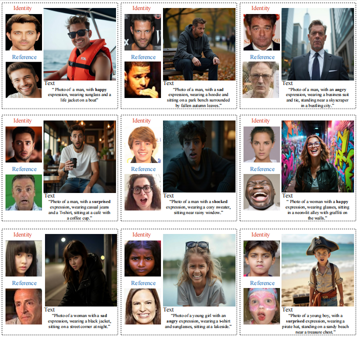  
**Description:** ViDiExPo inference samples showing accurate expression and pose synthesis while maintaining subject identity and contextual fidelity.

### 🔁 Comparison with Baselines

#### 🧑‍🎨 Personalized Generation Baselines
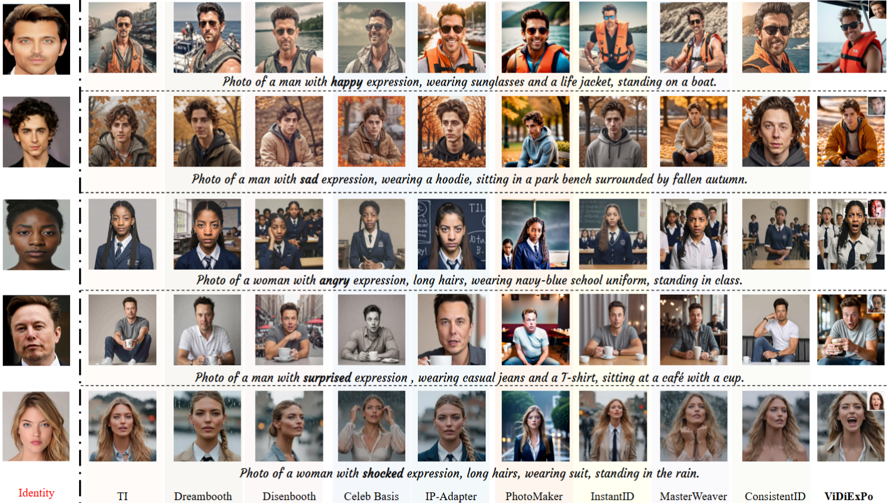  
**Description:** Qualitative comparison against personalized generation models. **ViDiExPo** maintains strong identity consistency while effectively transferring facial semantics and adhering to contextual prompts.

#### 😮 Expression Generation Baselines
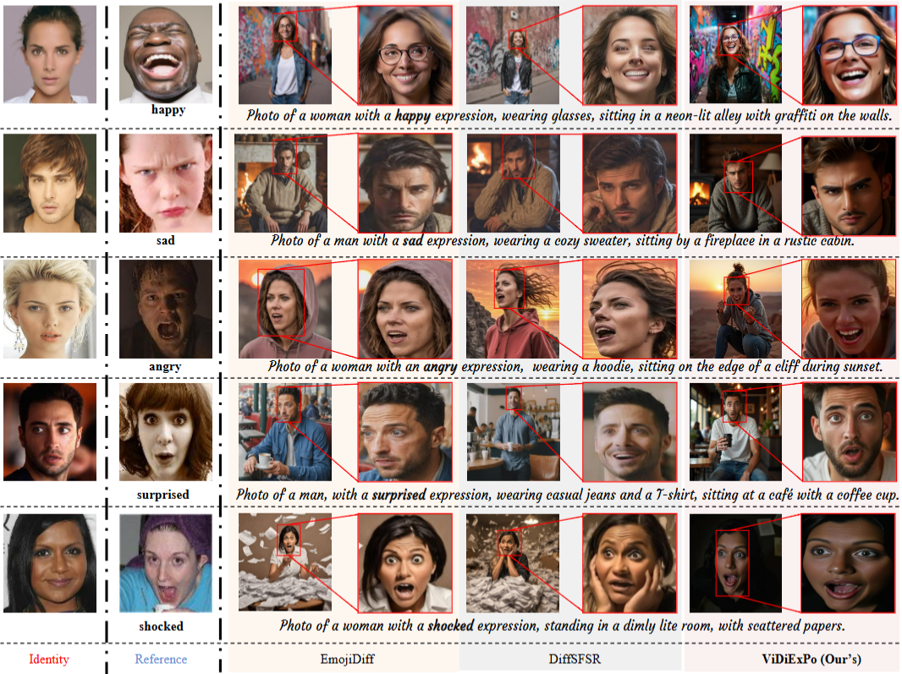  
**Description:** **ViDiExPo** achieves better identity preservation and precise semantic transfer (e.g., mouth and eye region alignment) compared to other expression generation techniques.

### 📊 Quantitative Evaluation

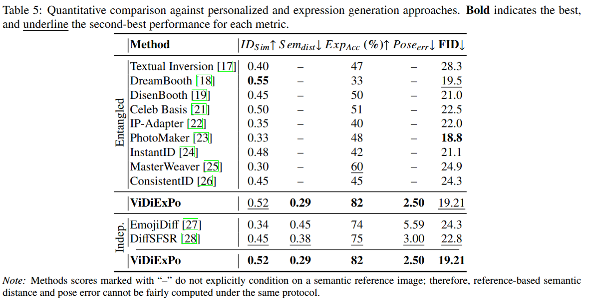  
**Description:** Quantitative evaluation highlights **ViDiExPo**'s superior performance in identity preservation and expression accuracy. Qualitative results emphasize expression realism, head pose accuracy, and facial fidelity.

### 🎯 Additional Results

#### 🧔 Male Subjects
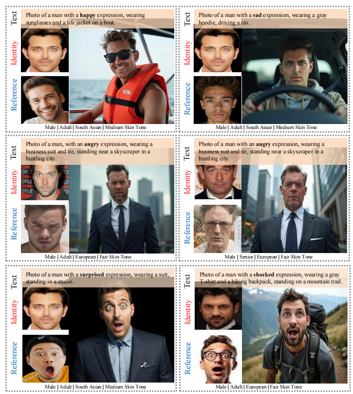  
ViDiExPo successfully generates realistic male facial expressions while preserving identity.

#### 👩 Female Subjects
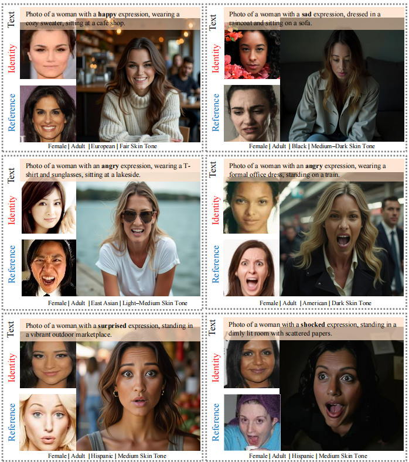  
Expression synthesis for female subjects across five expression types with high visual fidelity.

#### 🧒 Children Across Ethnic Groups
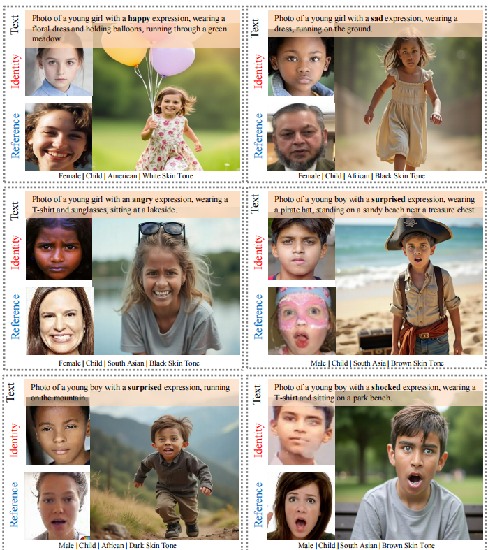  
Results demonstrate effective generation for young boys and girls of Indian, African, and European descent.

#### 🌍 Ethnic Diversity
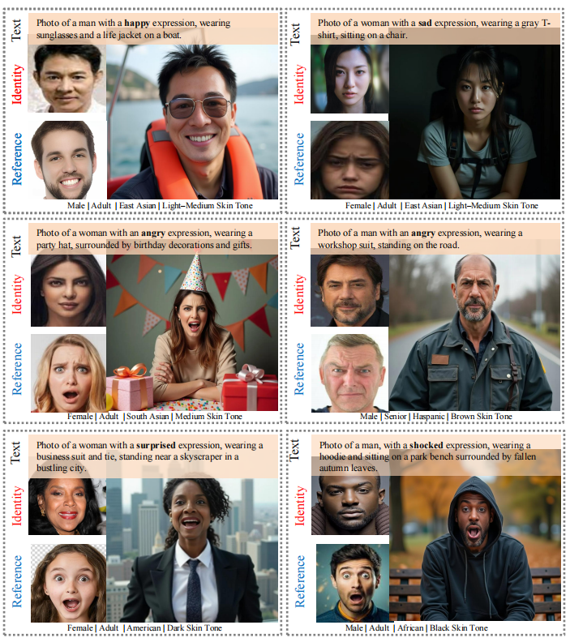  
The model maintains identity and expression accuracy across various ethnic groups.

#### 🔄 Cross‑Identity/Reference Combinations
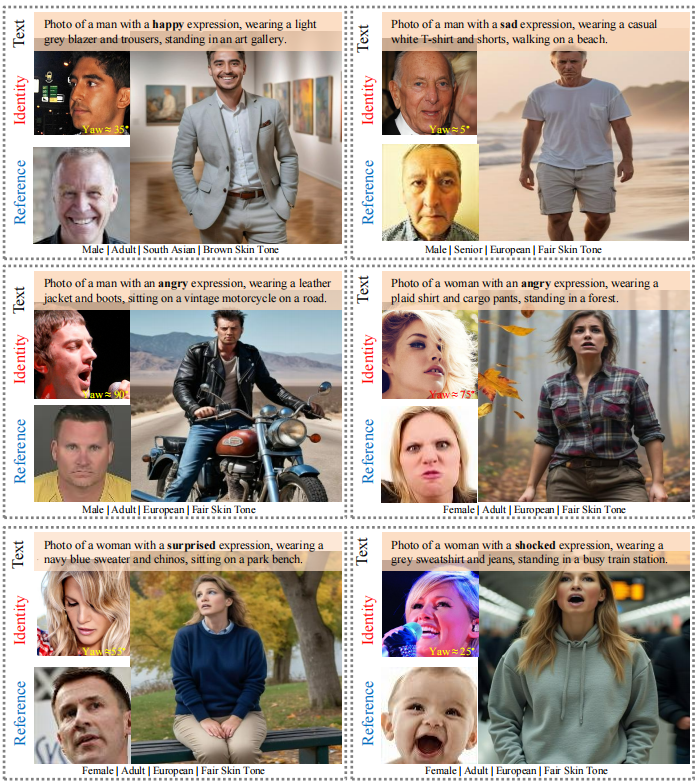  
Demonstrates flexibility in handling cross‑gender and cross‑ethnicity transformations while preserving identity.

#### 🙆‍♂️ Extreme Orientations
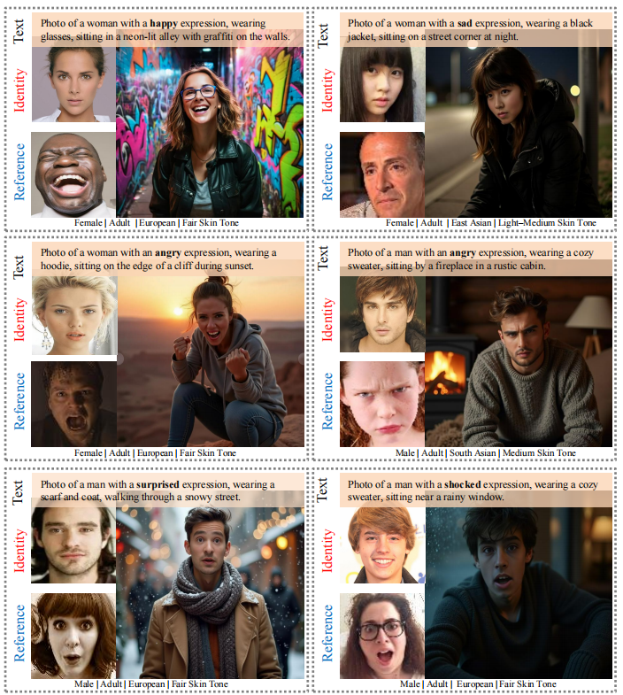  
Results show model limitations when both identity and reference inputs have extreme head poses, reflecting the boundaries of identity fidelity under such conditions.

---

## Key Hyperparameters

| Parameter | Value | Reference |
|-----------|-------|-----------|
| Embedding dim (E_id, E_sem) | 512 |
| DSID loss weights (λ1–λ5) | 1.0, 0.1, 1.0, 0.1, 0.1 | 
| Diffusion loss weights (β1, β2) | 0.5, 0.1 | 
| AAM-Softmax margin / scale | 0.2 / 30 |
| Triplet margin | 0.01 | 
| DSID training iterations | 100k | 
| Batch size (DSID) | 4/GPU × 4 GPU = 16 | 
| MRF tokens L | 16 | 
| MRF latent dim d | 512 | 
| DDIM steps | 50 |
| Output resolution | 512×512 | 

---


ViDiExPo implements:
1. **Access control:** full synthesis pipeline restricted to authorized research personnel
2. **Dual watermarking:** visible stamp + invisible Stable Signature (64-bit payload, 98% confidence)

All training images sourced from public datasets (CelebA-HQ, AffectNet) only.

---
